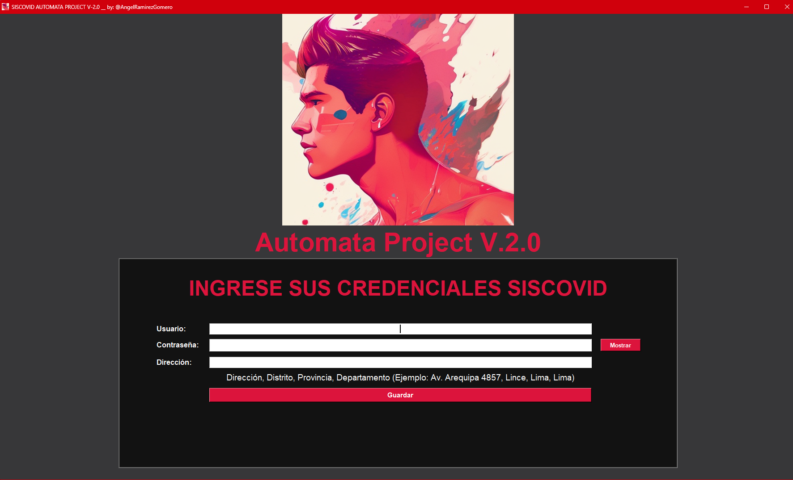
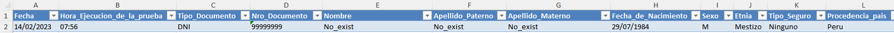
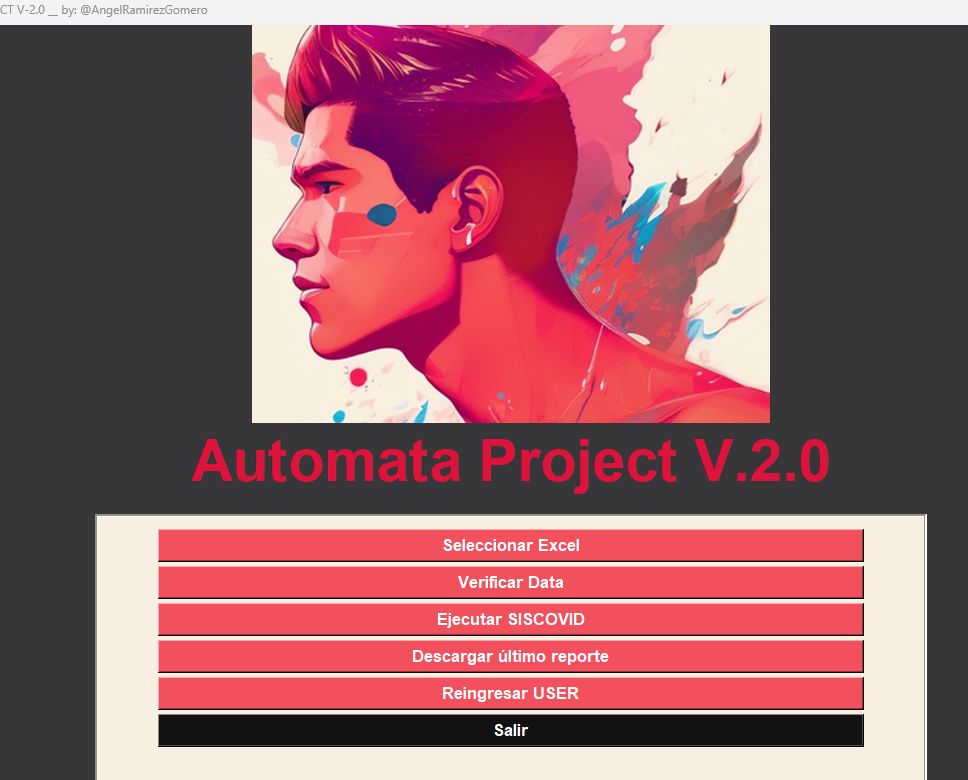

<h1 align="center"; font-family:Arial ; font-size:32px;">PROJECT SISCOVID AUTOMATA</h1>
<div style="text-align:center">
  
  <p style="font-style: italic; color: #444;"><span >Nota:</span> Las credenciales ingresadas no se guardan en ningun archivo o dependencia, sólo son transcritas al momento de la ejecución del programa.</p>
  
</div>

## Objetivo del Proyecto:
El proyecto AUTOMATA, busca mediante la creación de una interfaz de tipo aplicativo python <main.py> en el sistema operativo Windows, ejecutar el ingreso automatizado de pruebas antígenas contra la covid-19 en el aplicativo web SISCOVID del MINSA en Perú. Para esto el aplicativo solicitará se suministre el usuario y password SISCOVID con el que se hará el Login, una dirección la cuál será registrada como lugar de ejecución de la prueba en caso no se encuentre la dirección del paciente, y una base de datos en formato excel con los encabezados respectivos que se detallan en la sección DATA.

Se ha logrado cumplir con el objetivo planteado mediante la ejecución del aplicativo en python <main.py>, el cual es altamente personalizable y capaz de adquirir nuevas características y funcionalidades o servir de base para nuevos proyectos de automatización y análisis de datos.

También se ha creado una version ejecutable en windows SISCOVID-Automata.exe, ejecutable de 70 mb ya que almacena todas las dependencias necesarias, siendo el ejecutable independiente de dependencias,carpetas del proyecto o la instalación de python y sus paquetes. Sin embargo, este ejecutable no es capaz de actualizarse, personalizarse o agregar mayores funcionalidades. 


<div style="text-align:center">
  
</div>

## Justificación :
En el Perú, el registro de pruebas antígenas de detección de la COVID-19 tuvo serias complicaciones tanto a nivel estatal como privado, debido a que la plataforma SISCOVID no cuenta con la opción de registro en bloque a partir de un excel o base de datos que manejan las empresas privadas, o personal de salud que no puede realizar el registro directo prueba a prueba debido a que es una aplicativo web dependiente de la conexión a internet.

## Aplicativo al ejecutar <main.py>
<div style="text-align:center">
  
</div>
<p></p>
Luego de suministrar los datos necesarios para hacer el LOGIN en la plataforma, junto a la dirección alternativa para el registro de pruebas, la aplicación despliega las siguientes funcionalidades:<p></p>
<ol><li><p><strong>Seleccionar Excel :</strong> Al hacer click, me permite mediante un cuadro de diálogo, la búsqueda y selección del archivo que contiene los datos necesarios para el registro de las pruebas. Este archivo deberá contar con los encabezados y datos necesarios, los cuales serán cargados y modificados para su registro en la plataforma SISCOVID.</p></li><li><p><strong>Verificar Data :</strong> Este botón, ejecuta el archivo cargado al sistema, permitiéndo la visualización en Excel de los datos que van a ser cargados a la plataforma. Debe verificarse la fecha y hora que al ser pasados a formato texto debe mantener los valores deseados.</p></li><li><p><strong>Ejecutar SISCOVID :</strong> Ejecuta un chromedriver.exe, utilizando el módulo SELENIUM webdriver, para navegar a través de la plataforma SISCOVID y registrar con el usuario suministrado, las pruebas almacenadas en el registro, teniendo un tiempo promedio por registro de 5 segundos. <em>El navegador se ejecutará en pantalla completa, por lo que para evitar errores de superposición de elementos, se aconseja que no se manipule el ordenador mientras se ejecuta, ya que al término o en caso de error, el navegador culminará su ejecución de forma automática</em></p></li><li><p><strong>Descargar último reporte :</strong> Mediante su ejecución, abre un cuadro de diálogo para seleccionar una carpeta donde se descargarán los archivos de REPORTE de la última ejecución del aplicativo. El reporte indica en la columna "ESTADO SISCOVID" si ha sido enviado, si aún no ha sido ingresado.</p></li><li><p><strong>Reingresar USER :</strong> Vuelve a mostrar el formulario para registrar los datos requeridos para el LOGIN, ya que usuarios no válidos no podrán ejecutar el sistema SISCOVID.</p></li><li><p><strong>Salir :</strong> Cierran el aplicativo.</p></li></ol>
<p></p>

## DATA :
La Data solicitada debe contar con los siguientes encabezados:

| Nombre de Columna                         | Descripción                                                                                                                                                                                                                                                                                                                                                                                                                                                                                                                                                                                                                                                     | Tipo de dato |
|---------------------------------|------------------------------------------------------------------------------------------------------------------------------------------------------------------------------------------------------------------------------------------------------------------------------------------------------------------------------------------------------------------------------------------------------------------------------------------------------------------------------------------------------------------------------------------------------------------------------------------------------------------------------------------------------------------|--------------|
| Fecha                           | Fecha de la ejecución de la prueba en formato "día/mes/año" (dd/mm/yyyy).                                                                                                                                                                                                                                                                                                                                                                                                                                                                                                                                                                                                                           | Texto        |
| Hora_Ejecucion_de_la_prueba     | Hora de la ejecución de la prueba en formato "HH:MM"(09:08).                                                                                                                                                                                                                                                                                                                                                                                                                                                                                                                                                                                                                            | Texto        |
| Tipo_Documento                  | Tipo de documento de identidad del paciente (DNI, PAS, CE, CI, ASI), Dónde CE: Carnet de Extranjería, CI : Cédula de identidad, ASI : Sin documento                                                                                                                                                                                                                                                                                                                                                                                                                                                                                                                                                                                           | Texto        |
| Nro_Documento                   | Número de documento de identidad del paciente (Puede incluir letras en caso de Pasaporte).                                                                                                                                                                                                                                                                                                                                                                                                                                                                                                                                                                                                               | Texto        |
| Nombre                          | Nombre del paciente.                                                                                                                                                                                                                                                                                                                                                                                                                                                                                                                                                                                                                                         | Texto        |
| Apellido_Paterno                | Apellido paterno del paciente.                                                                                                                                                                                                                                                                                                                                                                                                                                                                                                                                                                                                                               | Texto        |
| Apellido_Materno                | Apellido materno del paciente.                                                                                                                                                                                                                                                                                                                                                                                                                                                                                                                                                                                                                               | Texto        |
| Fecha_de_Nacimiento             | Fecha de nacimiento del paciente (dd/mm/yyyy).                                                                                                                                                                                                                                                                                                                                                                                                                                                                                                                                                                                                                            | Texto        |
| Sexo                            | Sexo del paciente (M para masculino, F para femenino).                                                                                                                                                                                                                                                                                                                                                                                                                                                                                                                                                                                                       | Texto        |
| Etnia                           | Etnia a la que pertenece el paciente (escribirlo como aparece en las opciones de siscovid, en su defecto de no encontrar coincidencia selecciona "Mestizo").                                                                                                                                                                                                                                                                                                                                                                                                                                                                                                                                                                                                                         | Texto        |
| Tipo_Seguro                     | Tipo de seguro médico que tiene el paciente . Este dato es necesario para el funcionamiento del aplicativo, sin embargo aún falta implementar la funcionalidad para reconocer los tipos de seguro, ya que por defecto toma a todos los pacientes nuevos como "No tiene" o "Sin seguro".                                                                                                                                                                                                                                                                                                                                                                                                                                                                                                                                                                                                                 | Texto        |
| Procedencia_pais                | País de procedencia del paciente.                                                                                                                                                                                                                                                                                                                                                                                                                                                                                                                                                                                                                            | Texto        |
| Codigo_Pais                     | Código del país de procedencia del paciente.                                                                                                                                                                                                                                                                                                                                                                                                                                                                                                                                                                                                                 | Texto        |
| Celular                         | Número de teléfono celular del paciente.                                                                                                                                                                                                                                                                                                                                                                                                                                                                                                                                                                                                                    | Texto        |
| Correo                          | Dirección de correo electrónico del paciente.                                                                                                                                                                                                                                                                                                                                                                                                                                                                                                                                                                                                               | Texto        |
| Tipo_de_Residencia              | Tipo de residencia del paciente (casa, departamento, etc.).                                                                                                                                                                                                                                                                                                                                                                                                                                                                                                                                                                                                  | Texto        |
| Direccion                       | Dirección del domicilio del paciente.                                                                                                                                                                                                                                                                                                                                                                                                                                                                                                                                                                                                                        | Texto        |
| Departamento                    | Departamento donde se ubica el domicilio del paciente.                                                                                                                                                                                                                                                                                                                                                                                                                                                                                                                                                                                                      | Texto        |
| Provincia                       | Provincia donde se ubica el domicilio del paciente.                                                                                                                                                                                                                                                                                                                                                                                                                                                                                                                                                                                                         | Texto        |
| Distrito                        | Distrito donde se ubica el domicilio del paciente.                                                                                                                                                                                                                                                                                                                                                                                                                                                                                                                                                                                                          | Texto        |
| Tiene_Sintomas                  | Indica si el paciente presenta síntomas o no (SI o NO).                                                                                                                                                                                                                                                                                                                                                                                                                                                                                                                                                                                                      | Texto        |
| Fecha_de_inicio_de_Sintomas     | Fecha de inicio de los síntomas del paciente.                                                                                                                                                                                                                                                                                                                                                                                                                                                                                                                                                                                                                | Texto        |
| Marque_los_Sintomas_presenta    | Seleccione un síntoma de los que presenta (tos, fiebre, dolor de cabeza, etc.).                                                                                                                                                                                                                                                                                                                                                                                                                                                                                                                                                                             | Texto        |
| Otros_especificar               | Si el paciente presenta algún otro síntoma además del que está en Marque_los_Sintomas_presenta, o que no se encuentra en la lista de síntomas, se especifica aquí.         Dejar vacío en caso no haya algo que poner.                                                                                                                                                                                                                                                                                                                                                                                                                                                                                                                                                      | Texto        |
|Condicion_de_la_Persona| Condición del paciente (asintomático, sintomático leve, sintomático moderado, sintomático severo).|Texto||
Procedencia_solicitud_diag| Lugar donde el paciente solicitó la prueba de diagnóstico.|Texto|
Resultado_de_la_prueba: |Resultado de la prueba de diagnóstico (reactivo o no reactivo).|Texto|
|Clasifica_clinica_severidad:| Clasificación clínica de la severidad del paciente (leve, moderado, severo, crítico).|Texto|
|El_paciente_condicion_riesgo:| Si el paciente tiene alguna condición de riesgo para complicaciones, se especifica aquí.|Texto|
|Tipo_Muestra: |Tipo de muestra utilizada para la prueba de diagnóstico (hisopado nasofaríngeo, saliva, etc.).|Texto|
|Tipo_Lectura: |Tipo de lectura utilizada para la prueba. Ya que esta aplicación se realizó para las pruebas de antígeno siempre es Visual (Visual).|Texto||||

<div></div>

## REQUERIMIENTOS : 

### SISCOVID-Automata.exe :
<ol>
<li>Sistema operativo Windows 10 o superior.</li>
<li>Descargar el ejecutable "SISCOVID-Automata.exe"</li>
<li>Ubicar el ejecutable en su directorio predilecto, de preferencia el escritorio.</li>
<li>Ejecutar con su data pendiente de ingresar.</li>
<li>En caso de errores optar por main.py .</li>
</ol>

### <main.py>:
<ol>
<li>Sistema operativo Windows.</li>
<li>Tener instalado Microsoft Excel y Microsoft Word.</li>
<li>Tener Instalado Google Crhome</li>
<li>Descargar e instalar Python en la computadora.</li>

<li>Instalar los paquetes requeridos para el funcionamiento de la aplicación python , ejecutando en consola el comando :</p>

  ```pip install pandas numpy matplotlib seaborn openpyxl xlrd lxml python-docx pywin32 selenium webdriver-manager unidecode tkinter```</li>

<li>Clonar este repositorio en un directorio de su preferencia mediante:

  `git clone https://github.com/Aramir95/Project-SISCOVID-Automata.git `</li>

<li>Ubicarse mediante el terminal en la carpeta donde se encuentre el archivo main.py, y ejecutar en consola:</p>

  ```python main.py```</li>

<li>En caso de errores, verificar que cuenta con los paquetes requeridos con las siguientes versiones :

<table><thead><tr><th>Paquete</th><th>Versión</th></tr></thead><tbody><tr><td>altgraph</td><td>0.17.3</td></tr><tr><td>async-generator</td><td>1.10</td></tr><tr><td>attrs</td><td>22.2.0</td></tr><tr><td>certifi</td><td>2022.12.7</td></tr><tr><td>cffi</td><td>1.15.1</td></tr><tr><td>charset-normalizer</td><td>3.0.1</td></tr><tr><td>colorama</td><td>0.4.6</td></tr><tr><td>contourpy</td><td>1.0.7</td></tr><tr><td>cycler</td><td>0.11.0</td></tr><tr><td>et-xmlfile</td><td>1.1.0</td></tr><tr><td>exceptiongroup</td><td>1.1.0</td></tr><tr><td>fonttools</td><td>4.38.0</td></tr><tr><td>h11</td><td>0.14.0</td></tr><tr><td>idna</td><td>3.4</td></tr><tr><td>kiwisolver</td><td>1.4.4</td></tr><tr><td>lxml</td><td>4.9.2</td></tr><tr><td>matplotlib</td><td>3.7.0</td></tr><tr><td>numpy</td><td>1.24.2</td></tr><tr><td>openpyxl</td><td>3.1.1</td></tr><tr><td>outcome</td><td>1.2.0</td></tr><tr><td>packaging</td><td>23.0</td></tr><tr><td>pandas</td><td>1.5.3</td></tr><tr><td>pefile</td><td>2023.2.7</td></tr><tr><td>Pillow</td><td>9.4.0</td></tr><tr><td>pycparser</td><td>2.21</td></tr><tr><td>pyinstaller-hooks-contrib</td><td>2023.0</td></tr><tr><td>pyparsing</td><td>3.0.9</td></tr><tr><td>PySocks</td><td>1.7.1</td></tr><tr><td>python-dateutil</td><td>2.8.2</td></tr><tr><td>python-docx</td><td>0.8.11</td></tr><tr><td>python-dotenv</td><td>1.0.0</td></tr><tr><td>pytz</td><td>2022.7.1</td></tr><tr><td>pywin32</td><td>305</td></tr><tr><td>pywin32-ctypes</td><td>0.2.0</td></tr><tr><td>requests</td><td>2.28.2</td></tr><tr><td>seaborn</td><td>0.12.2</td></tr><tr><td>selenium</td><td>4.8.2</td></tr><tr><td>six</td><td>1.16.0</td></tr><tr><td>sniffio</td><td>1.3.0</td></tr><tr><td>sortedcontainers</td><td>2.4.0</td></tr><tr><td>tqdm</td><td>4.64.1</td></tr><tr><td>trio</td><td>0.22.0</td></tr><tr><td>trio-websocket</td><td>0.9.2</td></tr><tr><td>Unidecode</td><td>1.3.6</td></tr><tr><td>urllib3</td><td>1.26.14</td></tr><tr><td>webdriver-manager</td><td>3.8.5</td></tr><tr><td>wsproto</td><td>1.2.0</td></tr><tr><td>xlrd</td><td>2.0.1</td></tr></tbody></table>
</li>
</ol>

#### Contacto : ramirezgomeroangel@gmail.com